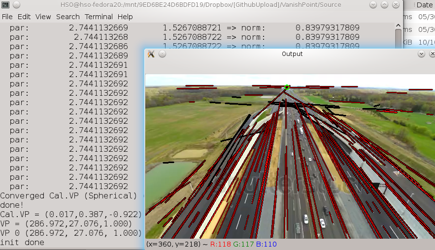

## Synopsis

Automatic vanishing point detection using LMS and optimized method.  
Canny detector and hough line are used in order to detect the lines.  

## Features 

The system automatically computes the vanishing point in the image.  
 
User can define how manu VP can be detected.  

## Videos/Images

Points.  
 

## Contributors

Main Developer: HSO   
Email: hugo(dot)soares(at)fe(dot)up(dot)pt  
